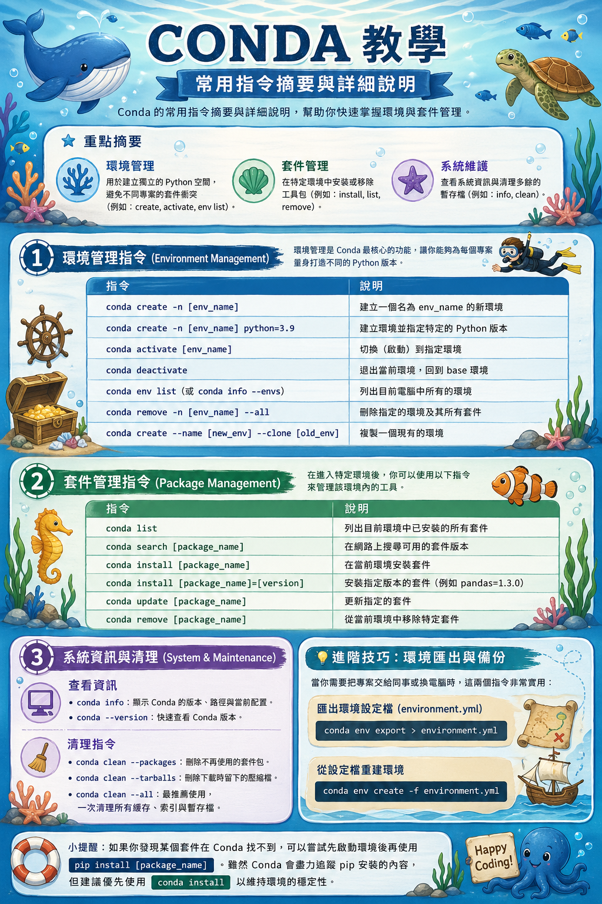

# 第 10 週補充教學：Conda 指令教學

> 本講義整理 Conda 的常用指令，幫助你快速掌握 Python 環境與套件管理。



---

## 學習目標

1. 認識 Conda 在 Python 開發中扮演的角色
2. 學會使用 Conda 建立、切換、刪除虛擬環境
3. 學會在環境中安裝、更新、移除套件
4. 學會查看 Conda 系統資訊與清理暫存
5. 學會匯出與重建環境設定檔，方便跨機器移植

---

## 重點摘要

| 功能類別 | 用途 | 代表指令 |
|---------|------|---------|
| 環境管理 | 建立獨立的 Python 空間，避免不同專案的套件衝突 | `create`、`activate`、`env list` |
| 套件管理 | 在特定環境中安裝或移除工具包 | `install`、`list`、`remove` |
| 系統維護 | 查看系統資訊與清理多餘的暫存檔 | `info`、`clean` |

---

## 1. 環境管理指令（Environment Management）

環境管理是 Conda 最核心的功能，讓你能夠為每個專案量身打造不同的 Python 版本。

| 指令 | 說明 |
|------|------|
| `conda create -n [env_name]` | 建立一個名為 `env_name` 的新環境 |
| `conda create -n [env_name] python=3.9` | 建立環境並指定特定的 Python 版本 |
| `conda activate [env_name]` | 切換（啟動）到指定環境 |
| `conda deactivate` | 退出當前環境，回到 base 環境 |
| `conda env list`（或 `conda info --envs`） | 列出目前電腦中所有的環境 |
| `conda remove -n [env_name] --all` | 刪除指定的環境及其所有套件 |
| `conda create --name [new_env] --clone [old_env]` | 複製一個現有的環境 |

### 操作示範

```bash
# 為本學期課程建立一個獨立環境
conda create -n bigdatacc python=3.11

# 進入該環境
conda activate bigdatacc
# 提示符會變成： (bigdatacc) user@host:~$

# 確認電腦中所有環境
conda env list

# 不再使用時，退出環境
conda deactivate

# 完全刪除某個環境（請先確認，不可還原）
conda remove -n bigdatacc --all
```

---

## 2. 套件管理指令（Package Management）

在進入特定環境後，可以使用以下指令來管理該環境內的工具。

| 指令 | 說明 |
|------|------|
| `conda list` | 列出目前環境中已安裝的所有套件 |
| `conda search [package_name]` | 在網路上搜尋可用的套件版本 |
| `conda install [package_name]` | 在當前環境安裝套件 |
| `conda install [package_name]=[version]` | 安裝指定版本的套件（例如 `pandas=1.3.0`） |
| `conda update [package_name]` | 更新指定的套件 |
| `conda remove [package_name]` | 從當前環境中移除特定套件 |

### 操作示範

```bash
# 進入環境後再裝套件，套件只會裝在這個環境
conda activate bigdatacc

# 安裝資料分析常用三件組
conda install pandas numpy matplotlib

# 確認套件是否裝好
conda list

# 想用特定版本（例如和教科書同版本）
conda install pandas=2.1.0

# 升級到最新版本
conda update pandas

# 移除不再需要的套件
conda remove matplotlib
```

### Conda 與 pip 的差異

| 項目 | conda install | pip install |
|------|---------------|-------------|
| 來源 | Conda 官方／社群 channel | PyPI |
| 相依性處理 | 自動解決 | 需自行處理 |
| 是否含 C 函式庫 | 多數有（如 NumPy、SciPy） | 部分需自行編譯 |
| 速度 | 較慢（需求解相依） | 較快 |

> **建議**：能用 `conda install` 就用 conda；若 conda 找不到，再用 pip。同一環境中兩者混用容易產生衝突，請斟酌使用。

---

## 3. 系統資訊與清理（System & Maintenance）

長期使用 Conda 會產生不少暫存檔，定期清理可以節省硬碟空間。

### 查看系統資訊

| 指令 | 說明 |
|------|------|
| `conda info` | 顯示 Conda 的版本、路徑與當前配置 |
| `conda --version` | 快速查看 Conda 版本 |

### 清理指令

| 指令 | 說明 |
|------|------|
| `conda clean --packages` | 刪除不再使用的套件包 |
| `conda clean --tarballs` | 刪除下載時留下的壓縮檔 |
| `conda clean --index-cache` | 刪除過期的索引快取 |
| `conda clean --all` | **最推薦使用**，一次清理所有快取、索引與暫存檔 |

### 操作示範

```bash
# 顯示 Conda 系統資訊
conda info

# 一鍵清理所有暫存（會列出可刪除項目，輸入 y 確認）
conda clean --all
```

---

## 4. 進階技巧：環境匯出與備份

當你需要把專案交給同事、或是換電腦繼續開發時，這兩個指令非常實用。

### 匯出環境設定檔（environment.yml）

```bash
# 在要備份的環境中執行
conda activate bigdatacc
conda env export > environment.yml
```

`environment.yml` 內容範例：

```yaml
name: bigdatacc
channels:
  - defaults
dependencies:
  - python=3.11.5
  - pandas=2.1.0
  - numpy=1.26.0
  - matplotlib=3.8.0
  - pip:
    - some-pip-only-package==1.0.0
```

### 從設定檔重建環境

```bash
conda env create -f environment.yml
```

> **小提醒**：如果某個套件在 Conda 找不到，可以嘗試先啟動環境後再使用 `pip install [package_name]`。雖然 Conda 會盡力追蹤 pip 安裝的內容，但建議優先使用 `conda install` 以維持環境的穩定性。

---

## 速查卡

| 用途 | 指令 |
|------|------|
| 建立新環境 | `conda create -n NAME python=3.X` |
| 啟動環境 | `conda activate NAME` |
| 退出環境 | `conda deactivate` |
| 列出所有環境 | `conda env list` |
| 刪除環境 | `conda remove -n NAME --all` |
| 列出已裝套件 | `conda list` |
| 安裝套件 | `conda install PKG` |
| 安裝指定版本 | `conda install PKG=VER` |
| 更新套件 | `conda update PKG` |
| 移除套件 | `conda remove PKG` |
| 查看系統資訊 | `conda info` |
| 清理所有暫存 | `conda clean --all` |
| 匯出環境設定 | `conda env export > environment.yml` |
| 從設定檔重建 | `conda env create -f environment.yml` |

---

## 常見地雷

| 問題 | 原因 | 解法 |
|------|------|------|
| 在 base 裝一堆套件 | 母環境被汙染，影響所有專案 | 永遠先 `conda create -n` 建立新環境 |
| `conda install` 跑超久 | 相依性求解慢 | 改用 `mamba`（Conda 加速版） |
| pip 與 conda 混裝出錯 | 兩套套件管理彼此干擾 | 同環境內優先 conda；pip 留到最後 |
| 忘了 activate 就 install | 套件被裝到 base 環境 | 每次開新終端機先 `conda activate [env]` |
| 硬碟越來越滿 | 暫存檔累積 | 每月跑一次 `conda clean --all` |

---

## 第 10 週作業：Conda 環境實作

### 作業資訊

| 項目 | 說明 |
|------|------|
| 繳交方式 | 在 Fork 的 `week10/` 資料夾中建立 `q1_conda.txt`，push 到 Fork |
| 繳交期限 | 下週上課前 |
| PR 標題 | 學號_姓名（首次繳交建立，之後 push 自動更新） |

### 繳交步驟

1. 同步老師的最新版本：到你的 Fork 頁面點「**Sync fork**」>「**Update branch**」
2. 本機拉取最新版：`git pull origin main`
3. 在 `week10/` 中建立 `q1_conda.txt`
4. 完成下方任務並貼上每步輸出
5. Push 到你的 Fork：
   ```bash
   git add week10/
   git commit -m "完成第10週作業"
   git push origin main
   ```

### 第 1 題：Conda 環境建立與套件管理

請在電腦上完成以下任務，將每步指令與輸出存入 `week10/q1_conda.txt`：

```
姓名：
學號：

=== 任務 1：確認 Conda 版本 ===
conda --version
（貼上結果）

conda info
（貼上結果，至少包含 conda version、active environment、base environment 三行）

=== 任務 2：建立新環境 ===
建立一個名為「學號_w10」的環境，Python 版本指定為 3.11
（例如學號 A11218001 → A11218001_w10）

conda create -n [你的學號]_w10 python=3.11 -y
（貼上最後幾行結果，看到 "done" 字樣）

conda env list
（貼上結果，確認環境出現在清單中）

=== 任務 3：啟動環境並安裝套件 ===
conda activate [你的學號]_w10
（貼上提示符變化，例如：(A11218001_w10) user@host:~$）

conda install pandas numpy matplotlib -y
（貼上最後幾行結果）

conda list | head -20
（貼上結果，確認 pandas、numpy、matplotlib 都在）

=== 任務 4：匯出環境設定檔 ===
conda env export > week10/environment.yml
cat week10/environment.yml
（貼上 environment.yml 完整內容）

=== 任務 5：清理暫存 ===
conda clean --all -y
（貼上結果，記錄釋放的空間大小，例如 "Removed XX MB"）

=== 任務 6：觀念回答 ===
Q1：為什麼不要直接在 base 環境安裝專案套件？這樣做有什麼壞處？
A1：

Q2：conda install 和 pip install 有什麼差異？什麼情況下會建議用 pip？
A2：

Q3：environment.yml 的用途是什麼？換電腦時要怎麼用它快速重建環境？
A3：
```

### 繳交 Checklist

- [ ] `week10/q1_conda.txt` 包含 6 項任務的指令與輸出
- [ ] `week10/environment.yml` 已產生並 push 到 Fork
- [ ] 三題觀念題已作答
- [ ] 已 push 到 Fork（確認 PR 中可看到本週 commit）

### 常見問題

**Q：執行 `conda` 指令出現 "command not found"？**
表示 Conda 還沒裝或環境變數沒設定。Windows 用戶請從「開始選單」開啟「Anaconda Prompt」操作；macOS / Linux 用戶請執行 `source ~/miniconda3/bin/activate` 後再試。

**Q：`conda activate` 出現 "CommandNotFoundError: Your shell has not been properly configured"？**
首次使用需執行一次 `conda init bash`（或 `conda init zsh`），然後關掉終端機重開即可。

**Q：建立環境時卡在 "Solving environment"？**
Conda 在求解相依性，較慢屬正常。若超過 5 分鐘可中斷後改用更快的求解器：`conda install -n base conda-libmamba-solver` 後再執行 `conda config --set solver libmamba`。

**Q：`conda install` 出現 PackagesNotFoundError？**
代表預設 channel 找不到該套件。可加上 conda-forge channel：`conda install -c conda-forge [package_name]`，仍找不到時才考慮用 `pip install`。

**Q：不小心把套件裝到 base 怎麼辦？**
先 `conda activate` 切到正確環境再裝一次。base 中誤裝的套件可用 `conda remove -n base [package_name]` 移除。
