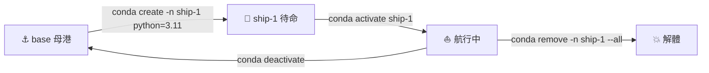

# 第 10 週補充教學：Conda 指令大全 🌊

> 把每個 Conda 環境想像成一艘獨立航行的船。每艘船載著自己的物資（套件）、走自己的航線（Python 版本），不會撞到隔壁那艘。本講義帶你掌握「造船、進船、補貨、清港」全套海事級指令。

---

## 🧭 航海總覽（Big Picture）

```
                            🌊  你的開發海域  🌊
   ┌──────────────────────────────────────────────────────────────┐
   │                                                              │
   │   ⚓ base 母港                                               │
   │   └── Conda 主控台（不要在這裡裝亂七八糟的東西）             │
   │                                                              │
   │   🚢 env: data-analysis        🛥️ env: web-scraper           │
   │   ├── python=3.11              ├── python=3.9                │
   │   ├── pandas, numpy            ├── requests, bs4             │
   │   └── matplotlib               └── selenium                  │
   │                                                              │
   │   ⛵ env: ml-lab                🐠 env: thesis-2026           │
   │   ├── python=3.10              ├── python=3.11               │
   │   ├── tensorflow, keras        ├── jupyter, scipy            │
   │   └── scikit-learn             └── statsmodels               │
   │                                                              │
   └──────────────────────────────────────────────────────────────┘
                              ⬇
                  每艘船彼此隔離，互不干擾
```

| 🐚 三大功能群 | 海事比喻 | 對應指令 |
|---|---|---|
| 🚢 **環境管理** | 造船、登船、棄船 | `create` / `activate` / `env list` |
| 📦 **套件管理** | 補貨、卸貨、盤點 | `install` / `list` / `remove` |
| 🧹 **系統維護** | 港口巡檢、清淤 | `info` / `clean` |

---

## 🚢 1. 環境管理（Environment Management）

> 每個專案都該有自己的船。混在 `base` 母港裝套件，遲早撞船。

### 🛠️ 造船指令一覽

```
   📐  造船廠
   ┌─────────────────────────────────────────────────────┐
   │                                                     │
   │   conda create -n [env_name]                        │
   │   ──────────────────────────────                    │
   │   ⛏️  造一艘空船（用預設 Python）                   │
   │                                                     │
   │   conda create -n [env_name] python=3.9             │
   │   ──────────────────────────────────────            │
   │   ⛏️  造一艘船並指定主機（Python 版本）             │
   │                                                     │
   │   conda create --name [new] --clone [old]           │
   │   ──────────────────────────────────────            │
   │   👯  仿造姊妹艦（複製現有環境）                    │
   │                                                     │
   └─────────────────────────────────────────────────────┘
```

| 指令 | 海事比喻 | 說明 |
|---|---|---|
| `conda create -n [env_name]` | 🚢 造一艘新船 | 建立名為 `env_name` 的新環境 |
| `conda create -n [env_name] python=3.9` | 🚢 造船並指定引擎型號 | 建立環境並指定 Python 版本 |
| `conda activate [env_name]` | ⚓ 登船啟航 | 切換到指定環境 |
| `conda deactivate` | 🪜 下船回岸 | 退出當前環境，回到 base |
| `conda env list` | 🗺️ 看港口船舶名冊 | 列出所有環境（同 `conda info --envs`） |
| `conda remove -n [env_name] --all` | 💥 解體拆船 | 刪除整個環境（不可逆！） |
| `conda create --name [new] --clone [old]` | 👯 仿造姊妹艦 | 複製現有環境 |

### 🌊 啟航流程示意



### 💡 實戰範例

```bash
# 為本學期 BigDataCC 課程造一艘船
conda create -n bigdatacc python=3.11

# 登船
conda activate bigdatacc
# 提示符會變成：(bigdatacc) user@host:~$

# 看看自己造了哪些船
conda env list
# # conda environments:
# #
# base                  *  /home/user/miniconda3
# bigdatacc                /home/user/miniconda3/envs/bigdatacc

# 不想玩了，回母港
conda deactivate
```

---

## 📦 2. 套件管理（Package Management）

> 登船後才能補貨。在哪艘船上裝的貨，只有那艘船能用。

### 🐟 補貨／卸貨／盤點

```
   🏝️  套件補給站
   ┌──────────────────────────────────────────────────┐
   │                                                  │
   │     🔍 search          📋 list                   │
   │     先打聽哪裡有貨    看看船上有啥                │
   │         │                  │                     │
   │         ▼                  ▼                     │
   │     ┌────────────────────────────┐               │
   │     │  🚢  conda activate [env]  │               │
   │     └────────────────────────────┘               │
   │         │                                        │
   │     ┌───┴────────────────────────┐               │
   │     ▼                            ▼               │
   │   📥 install                  📤 remove          │
   │   把貨搬上船                  把貨丟下船         │
   │     │                            │               │
   │     └────────────┬───────────────┘               │
   │                  ▼                               │
   │              🔄 update                           │
   │            升級老舊裝備                          │
   │                                                  │
   └──────────────────────────────────────────────────┘
```

| 指令 | 海事比喻 | 說明 |
|---|---|---|
| `conda list` | 📋 盤點貨艙 | 列出當前環境所有套件 |
| `conda search [package_name]` | 🔍 打聽補給站 | 搜尋可用的套件版本 |
| `conda install [package_name]` | 📥 補貨上船 | 在當前環境安裝套件 |
| `conda install [package_name]=[version]` | 📥 指定型號補貨 | 安裝特定版本（例：`pandas=1.3.0`） |
| `conda update [package_name]` | 🔄 升級裝備 | 更新指定套件 |
| `conda remove [package_name]` | 📤 丟棄貨物 | 移除指定套件 |

### 💡 實戰範例

```bash
conda activate bigdatacc

# 補資料分析三大件
conda install pandas numpy matplotlib

# 確認貨艙
conda list | head -10

# 想要特定版本（例如和教科書同版本）
conda install pandas=2.1.0

# 升級到最新
conda update pandas

# 不再需要某套件
conda remove matplotlib
```

### ⚠️ Conda vs pip：兩條補給路線

```
                  📦 套件來源
       ┌──────────────────────────────────┐
       │                                  │
   ┌───▼────┐                       ┌─────▼────┐
   │ Conda  │  🐢 速度較慢          │   pip    │  🐇 較快
   │  渠道  │  ✅ 自動處理相依       │  PyPI    │  ❌ 相依需手解
   │        │  ✅ 含 C 函式庫        │          │  ❌ C 函式庫常爆
   └────────┘                       └──────────┘

   👍 建議：能用 conda install 就用 conda；找不到才退而求其次用 pip
```

---

## 🧹 3. 系統資訊與清理（System & Maintenance）

> 開久了港口會堆滿廢棄船骸與漂流貨。定期清淤，硬碟才有空間。

### 🐙 系統資訊

| 指令 | 用途 |
|---|---|
| `conda info` | 🗺️ 顯示版本、路徑、設定（港口巡檢報告） |
| `conda --version` | ⏱️ 快速看 Conda 版本 |

### 🗑️ 清港四式

```
   ⚠️  港口廢棄物分類
   ┌─────────────────────────────────────────────────────────┐
   │                                                         │
   │  🦀 conda clean --packages    刪不再使用的套件包        │
   │  🦐 conda clean --tarballs    刪下載留下的壓縮檔        │
   │  🦑 conda clean --index-cache 刪過期的索引快取          │
   │                                                         │
   │  🐳 conda clean --all  ⭐ 一鍵全清（最推薦）            │
   │     └──> 把上面三項一次處理掉                           │
   │                                                         │
   └─────────────────────────────────────────────────────────┘
```

| 指令 | 說明 |
|---|---|
| `conda clean --packages` | 🦀 刪除不再使用的套件包 |
| `conda clean --tarballs` | 🦐 刪除下載留下的壓縮檔 |
| `conda clean --all` | 🐳 **最推薦**，一次清理所有快取、索引與暫存檔 |

### 💡 實戰範例

```bash
# 看 Conda 健康狀態
conda info

# 通常會看到：
#      active environment : bigdatacc
#     active env location : /home/user/miniconda3/envs/bigdatacc
#             shell level : 1
#        user config file : /home/user/.condarc
#             conda version : 24.x.x
#               python version : 3.11.x

# 一鍵清港
conda clean --all
# 會列出可清理的項目，輸入 y 確認
```

---

## 🪸 4. 進階技巧：環境匯出與備份

> 把你那艘船的設計圖（`environment.yml`）寄給同事，他就能造一艘一模一樣的。

```
   📜 設計圖流程
   ┌───────────────────────────────────────────────────────────┐
   │                                                           │
   │  你的電腦 🖥️                          同事的電腦 🖥️       │
   │      │                                       ▲           │
   │      │ conda env export > environment.yml    │           │
   │      ▼                                       │           │
   │   📄 environment.yml ─── 📤 寄送 ──> 📄 environment.yml  │
   │                                              │           │
   │                                              │ conda env │
   │                                              │ create -f │
   │                                              ▼           │
   │                                         🚢 一模一樣的船  │
   │                                                           │
   └───────────────────────────────────────────────────────────┘
```

### 匯出環境設定檔

```bash
# 在要備份的環境中執行
conda activate bigdatacc
conda env export > environment.yml
```

`environment.yml` 內容範例：

```yaml
name: bigdatacc
channels:
  - defaults
dependencies:
  - python=3.11.5
  - pandas=2.1.0
  - numpy=1.26.0
  - matplotlib=3.8.0
  - pip:
    - some-pip-only-package==1.0.0
```

### 從設定檔重建環境

```bash
conda env create -f environment.yml
```

> 🐠 **小提醒**：如果某套件 Conda 找不到，可以**先 activate 環境後再用 `pip install [package_name]`**。Conda 會盡力追蹤 pip 安裝的內容，但**優先使用 `conda install` 以維持環境穩定**。

---

## 🐚 速查卡（航海員口袋版）

```
   🌊 ──────────────  Conda 指令速查卡  ────────────── 🌊

   🚢 造船            conda create -n NAME python=3.X
   ⚓ 登船            conda activate NAME
   🪜 下船            conda deactivate
   🗺️  看船隊        conda env list
   💥 拆船            conda remove -n NAME --all

   📋 盤點            conda list
   📥 補貨            conda install PKG
   📥 指定版本        conda install PKG=VER
   🔄 升級            conda update PKG
   📤 卸貨            conda remove PKG

   🗺️  巡檢          conda info
   🐳 清港            conda clean --all

   📜 出口設計圖      conda env export > environment.yml
   📜 進口設計圖      conda env create -f environment.yml

   🌊 ────────────────────────────────────────────── 🌊
```

---

## 🦈 常見地雷（GOTCHAS）

| 地雷 | 為什麼會炸 | 解法 |
|---|---|---|
| 在 `base` 裝一堆套件 | 母港被汙染，所有專案連動受影響 | 永遠先 `conda create -n` 造新船 |
| `conda install` 跑超久 | 相依性求解慢 | 改用 `mamba`（Conda 加速版） |
| pip 和 conda 混裝 | 兩套套件管理打架 | 同個環境內優先 conda；pip 留到最後 |
| 忘了 activate 就 install | 套件裝到 base | 每次開新終端機都先 `conda activate` |
| 硬碟越來越滿 | 暫存檔累積 | 每月跑一次 `conda clean --all` |

---

## 🐳 練習任務（選做，不計分）

1. 造一艘叫 `w10-conda` 的船，Python 指定 3.11
2. 登船後安裝 `pandas` 和 `jupyter`
3. 用 `conda list` 截圖證明套件已裝好
4. 匯出 `environment.yml` 並貼到 week10 資料夾
5. 用 `conda clean --all` 清港，記錄釋放了多少空間

> 完成後可在 `week10/supplement_conda_log.txt` 記錄你的航海日誌（截圖或貼上每步指令的輸出）。

---

> 🌊 **記住：每個專案都值得擁有自己的一艘船。** 母港只是出發點，不是貨倉。
